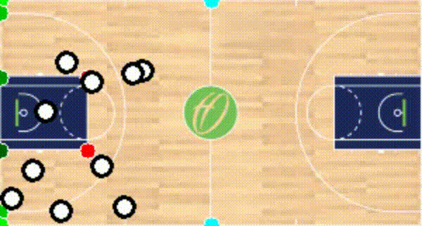

# Basketball Game Tracker 🏀


Basketbol maçlarını analiz etmek, oyuncu/top takibi yapmak ve saha içi istatistikleri çıkarmak amacıyla geliştirilen yapay zeka tabanlı bir bilgisayarlı görü projesidir.

> 🚧 **Not:** Bu proje şu anda aktif geliştirme aşamasındadır. Özellikler ve kod yapısı değişiklik gösterebilir.

## 🎯 Proje Hakkında

Bu proje, ham maç görüntülerini işleyerek anlamlı veriler çıkarmayı hedefler. Derin öğrenme modelleri ve görüntü işleme teknikleri kullanılarak sahadaki nesneler algılanır ve konumlandırılır.

### Öne Çıkan Özellik: Oyuncu ve Saha Segmentasyonu
Projenin en güçlü yeteneklerinden biri, SAM2 kullanarak oyuncuları ve oyun alanını videodan piksel hassasiyetinde ayrıştırıp maskeleyebilmesidir.


### Taktik Görünüm (Tactical View)
Oyuncuların saha içindeki gerçek konumları, homografi (homography) ve saha anahtar noktaları kullanılarak 2D bir taktik haritaya yansıtılır.




## ✨ Özellikler (Mevcut ve Planlanan)

* [x] **Saha Segmentasyonu:** Oyun alanının tespiti ve maskelenmesi.
* [x] **Nesne Tespiti (Object Detection):** Oyuncuların, hakemlerin ve topun tespiti (YOLO + SAM2 Tracking).
* [x] **Takım Ayrıştırma:** Oyuncuların forma numaralarına göre ayrıştırılması (Jersey OCR & Re-ID).
* [x] **Perspektif Dönüşümü:** Kamera görüntüsünün 2D taktik tahtasına dönüştürülmesi (Homografi).
* [ ] **Hareket Takibi:** Oyuncuların hız ve kat ettikleri mesafenin hesaplanması.

## 🛠️ Kurulum

Projeyi yerel makinenizde çalıştırmak için aşağıdaki adımları izleyin:

1.  **Repoyu klonlayın:**
    ```bash
    git clone https://github.com/hasan-bakr/BasketballGameTracker.git
    cd BasketballGameTracker
    ```

2.  **Sanal ortam oluşturun (Conda Önerilir):**
    ```bash
    conda create -n dsci python=3.12
    conda activate dsci
    ```

3.  **Gereksinimleri yükleyin:**
    Gereken ana paketler: `torch`, `torchvision`, `ultralytics`, `opencv-python`, `sam2`.

## 🚀 Kullanım

Modeli test etmek için ana tracker dosyasını çalıştırın:

```bash
python APP/helpers/robust_sam2_tracker.py
```

📂 **Proje Yapısı Özet:**
* `APP/helpers/`: Tracker mantığı, SAM2 ve YOLO entegrasyonu.
* `videos/output/`: İşlenmiş demo videoların kaydedildiği dizin.
* `models/`: YOLO ve diğer ağırlık dosyaları.
* `basketball_analysis/`: Analiz ve araç dosyaları.