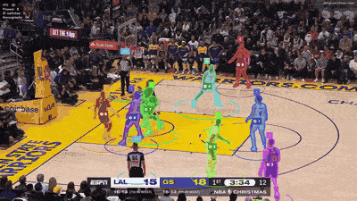
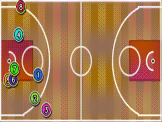

# Basketball Game Tracker


Basketbol mac videolari icin bilgisayarli goru pipeline'i. Oyuncu ve hakemleri algilar, kalabalik pozisyonlarda oyuncu kimliklerini korumaya calisir, forma numaralarini okur ve oyuncu konumlarini 2D taktik saha gorunumune aktarir.

English documentation: [README.md](README.md)

## Demo

> Yayina almadan once final GIF'leri buraya ekle:
>
> - `media/demo_tracking.gif`
> - `media/demo_tactical.gif`

**Ana video tracking gorunumu**



**Taktik saha gorunumu**



## One Cikanlar

- RF-DETR ile oyuncu, hakem ve forma bolgesi algilama
- MCByte ile coklu oyuncu takibi
- SAM + Cutie ile maske propagasyonu ve mask destekli association
- Occlusion anlarinda duplicate ve phantom track baskilama
- PARSeq OCR ve voting tabanli forma numarasi bankasi
- YOLO-Pose saha keypoint algilama ve RANSAC homography
- Keypoint carry, sag/sol saha gecisi kontrolu ve smoothing ile daha stabil tactical view
- Ana video ve tactical view icin ayri cikti videolari

## Modeller, Tracker'lar Ve Temel Kutuphaneler

| Bilesen | Nerede Kullaniliyor | Link |
|---|---|---|
| RF-DETR | Oyuncu, hakem, top ve forma-numara bolgesi detection'lari icin kullanilir. Varsayilan proje model id'si `basketball-player-detection-3-ycjdo/4`. | [RF-DETR](https://github.com/roboflow/rf-detr) |
| Roboflow Inference | RF-DETR modelini calistiran local/remote inference runtime. `ROBOFLOW_API_KEY` degeri `.env` dosyasindan okunur. | [Roboflow Inference](https://github.com/roboflow/inference) |
| MCByte | Ana multi-object tracker. Proje `external/mcbyte/` checkout'unu kullanir ve mask-aware association akisina duplicate suppression, mask isolation ve lost-track reuse mantigi ekler. | [MCByte](https://github.com/tstanczyk95/McByte), [makale](https://openaccess.thecvf.com/content/CVPR2025W/CVSPORTS/html/Stanczyk_No_Train_Yet_Gain_Towards_Generic_Multi-Object_Tracking_in_Sports_CVPRW_2025_paper.html) |
| ByteTrack | MCByte icindeki tracking-by-detection association tabani. | [ByteTrack](https://github.com/FoundationVision/ByteTrack) |
| Segment Anything (SAM) | Detector box'larindan ilk maskeleri uretir. Beklenen varsayilan agirlik `external/mcbyte/sam_models/sam_vit_b_01ec64.pth`. | [Segment Anything](https://github.com/facebookresearch/segment-anything) |
| Cutie | Oyuncu maskelerini frame'ler arasinda propagate eden video object segmentation modeli. Beklenen varsayilan agirlik `external/mcbyte/mask_propagation/Cutie/weights/cutie-base-mega.pth`. | [Cutie](https://github.com/hkchengrex/Cutie) |
| PARSeq | Local `parseq/` checkout'u ve STRHub modulleri uzerinden forma numarasi OCR'i. | [PARSeq](https://github.com/baudm/parseq) |
| Ultralytics YOLO Pose | Homography ve tactical view projection icin saha keypoint detection. Beklenen custom agirlik `models/keypoints/yolo26l-fine-tuned.pt`. | [Ultralytics](https://github.com/ultralytics/ultralytics), [pose dokumani](https://docs.ultralytics.com/tasks/pose/) |
| OpenCV | Homography estimation, perspective transform, video okuma/yazma, cizim ve tactical view render islemleri. | [OpenCV](https://opencv.org/) |
| Supervision | Gorsel output pipeline'indaki annotation helper'lari, renkler ve detection utility'leri. | [Supervision](https://github.com/roboflow/supervision) |
| PyTorch | Detector, tracker bagimliliklari, SAM, Cutie, PARSeq ve YOLO modellerinin deep-learning runtime'i. | [PyTorch](https://pytorch.org/) |

Destekleyici runtime ve utility bagimliliklari:

| Bilesen | Nerede Kullaniliyor | Link |
|---|---|---|
| NumPy / SciPy | Array islemleri, geometri hesaplari ve MCByte Kalman-filter matematigi. | [NumPy](https://numpy.org/), [SciPy](https://scipy.org/) |
| Pillow | Forma crop'larini PARSeq preprocessing oncesinde PIL image'e cevirir. | [Pillow](https://python-pillow.org/) |
| python-dotenv | `ROBOFLOW_API_KEY` gibi `.env` degerlerini secret commit etmeden yukler. | [python-dotenv](https://github.com/theskumar/python-dotenv) |
| LAP / FilterPy | MCByte tracking stack'inde assignment ve filtering yardimcilari. | [lap](https://github.com/gatagat/lap), [FilterPy](https://github.com/rlabbe/filterpy) |
| Hydra / OmegaConf | Cutie mask-propagation kodunun konfigurasyon sistemi. | [Hydra](https://hydra.cc/), [OmegaConf](https://omegaconf.readthedocs.io/) |
| h5py / scikit-image / Hugging Face Hub | External model bagimliliklarinin model/checkpoint ve image-processing utility'leri. | [h5py](https://www.h5py.org/), [scikit-image](https://scikit-image.org/), [Hugging Face Hub](https://huggingface.co/docs/huggingface_hub) |
| tqdm | External model utility ve script'lerinde progress bar. | [tqdm](https://github.com/tqdm/tqdm) |

## Pipeline

```text
Input video
    |
    v
RF-DETR detection
    |
    v
MCByte tracking + SAM/Cutie mask propagation
    |
    v
Forma OCR ve ID stabilizasyonu
    |
    v
Saha keypointleri + homography
    |
    v
Annotated video + tactical court video
```

## Proje Yapisi

```text
APP/
  __main__.py              CLI giris noktasi
  assets/
    basketball_court.png   Tactical court gorseli
  helpers/
    config.py              Merkezi konfigurasyon
    pipeline.py            Uctan uca pipeline
    mcbyte_tracker.py      MCByte ve maske wrapper'i
    rfdetr_detector.py     RF-DETR detector wrapper'i
    jersey_detector.py     PARSeq OCR ve forma bankasi
    court_utils.py         Homography ve tactical rendering
    team_detector.py       Takim rengi yardimcilari
```

## Gereksinimler

Onerilen ortam:

- Python 3.11+
- CUDA destekli GPU
- PyTorch 2.x
- RF-DETR inference icin Roboflow API key

Buyuk model dosyalari ve harici research repo'lari Git'e eklenmez. Full pipeline calismadan once lokal olarak yerlestirilmelidir.

Beklenen lokal assetler:

```text
models/keypoints/yolo26l-fine-tuned.pt
external/mcbyte/
external/mcbyte/sam_models/sam_vit_b_01ec64.pth
external/mcbyte/mask_propagation/Cutie/weights/cutie-base-mega.pth
parseq/
```

## Kurulum

```bash
git clone https://github.com/hasan-bakr/Basketball-Game-Tracker.git
cd Basketball-Game-Tracker

conda create -n bgt python=3.11 -y
conda activate bgt

pip install torch torchvision --index-url https://download.pytorch.org/whl/cu124
pip install -r requirements.txt
```

Environment dosyasini olustur:

```bash
cp .env.example .env
```

Sonra API key'i gir:

```bash
ROBOFLOW_API_KEY=your_key_here
```

## Kullanim

```bash
python -m APP \
  --input videos/input/game.mp4 \
  --output videos/output/result.mp4 \
  --device cuda \
  --max-frames 300
```

Komut su ciktilari uretir:

```text
videos/output/result.mp4
videos/output/result_tactical.mp4
videos/output/LOG.log
```

## Faydalı CLI Parametreleri

| Parametre | Aciklama |
|---|---|
| `--input` | Input video yolu |
| `--output` | Annotated output video yolu |
| `--max-frames` | Islenecek maksimum frame sayisi |
| `--start` | Baslangic zamani, saniye |
| `--frame-skip` | Her N frame'de bir isleme |
| `--device` | `cuda`, `cuda:0` veya `cpu` |
| `--confidence` | Detector confidence override |
| `--detector-iou` | RF-DETR internal NMS IoU override |
| `--track-thresh` | MCByte high-score threshold |
| `--new-track-thresh` | Yeni track baslatma skoru |
| `--debug` | Tracking, mask ve keypoint debug loglari |
| `--debug-lifecycle` | Track lifecycle loglari |
| `--debug-suppression` | Duplicate suppression ve maske karar loglari |
| `--tracking-report-json` | Lifecycle summary JSON ciktisi |

## Notlar

- Input videolar, output videolar, model weightleri, API key'ler ve harici lokal repo'lar Git tarafindan ignore edilir.
- Tactical view saha keypointlerine baglidir. Pipeline ani homography ziplama riskini azaltmak icin son iyi keypointleri tasir ve kararsiz H guncellemelerini reddeder.
- Demo GIF'leri henuz eklenmedi. Yayindan once `media/` altina ekle.

## Roadmap

- Takim possession ve event seviyesinde analiz
- Sut ve top durumu entegrasyonu
- Hiz ve mesafe metrikleri
- Export edilebilir mac raporlari
